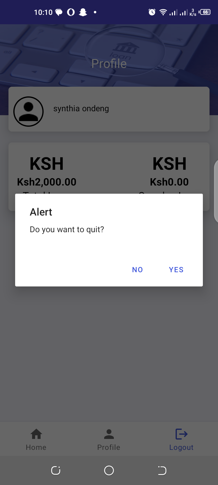

A simple loan management and application app with api and database hosted
## Demo

  

  
## Support
- Found this project useful ❤️? Support by clicking the ⭐️ button on the upper right of this page. ✌️
- Notice anything else missing? File an issue 
- Feel free to contribute in any way to the project from typos in docs to code review are all welcome.
